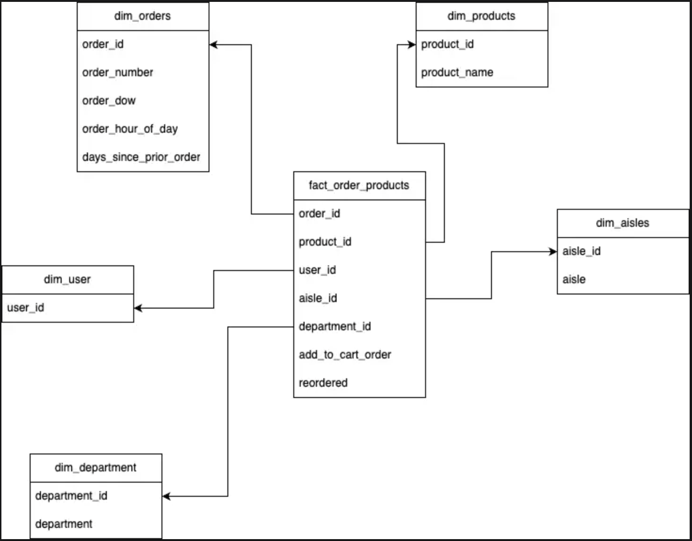

# 📦 E-Commerce Project - Building Dimensional Modelling

## 📊 Overview

This project focuses on implementing a dimensional model for an e-commerce dataset using the **Instacart Market Basket Analysis dataset**. It involves creating Snowflake tables, implementing ETL processes, designing fact and dimension tables, and performing analytical queries for actionable insights.

---

## 🔧 Key Features

- **Dimensional Modeling**: Created a star schema with one fact table and multiple dimension tables.
- **ETL Processing**: Loaded data from an S3 bucket into Snowflake using SQL and Snowflake stages.
- **Data Analysis**: Conducted insightful queries to understand product trends, user behavior, and reorder patterns.

---

## 🗂️ Data Model

The project follows a star schema, with a central fact table (`fact_order_products`) surrounded by dimension tables. Below is the data model:



---

## 🔄 Workflow

### Step 1: 📄 Data Source

- Dataset: [Instacart Market Basket Analysis](https://www.kaggle.com/competitions/instacart-market-basket-analysis/data)
- Uploaded to an Amazon S3 bucket in the `instacart` folder.

### Step 2: 🔐 Snowflake Setup

- Created a Snowflake schema named `instacart`.
- Configured an IAM role for Snowflake to access the S3 bucket.

### Step 3: 🔧 Data Loading and Table Creation

- Raw data was loaded into staging tables in Snowflake.
- Created fact and dimension tables using SQL scripts.

### Step 4: 🔎 Analysis

- Wrote analytical queries to:
  - Identify top-performing products and aisles.
  - Analyze user reorder trends.
  - Calculate average cart sizes and more.

---

## 📁 Directory Structure

```plaintext
e-commerce-project/
├── sql/
│   ├── 01_create_stage.sql          # Stage creation script
│   ├── 02_create_file_formats.sql   # File format definition
│   ├── 03_create_tables.sql         # Raw table creation
│   ├── 04_load_data.sql             # Data loading scripts
│   ├── 05_create_dimensions.sql     # Dimension table creation
│   ├── 06_create_fact_table.sql     # Fact table creation
│   ├── 07_analytics_queries.sql     # Analytical queries
│
├── README.md                        # Project documentation
├── fact_dimension_flowchart.png     # Fact-dimension table diagram
└── LICENSE                          # License file
```

---

## 🔧 How to Use

### 🔐 Prerequisites

To use this project, ensure you have the following:

- **Snowflake Account**: To execute the scripts.
- **Amazon S3 Bucket**: To store and stage data.
- **SQL Client**: To interact with Snowflake.

### 📜 Steps

1. Clone this repository:

   ```bash
   git clone https://github.com/your-repo/e-commerce-dim-model.git
   ```

2. Navigate to the `sql/` directory:

   ```bash
   cd e-commerce-project/sql
   ```

3. Execute the SQL scripts in the following order:

   - **01_create_stage.sql**: Creates the Snowflake stage linked to the S3 bucket.
   - **02_create_file_formats.sql**: Defines the file format for loading CSV data.
   - **03_create_tables.sql**: Creates raw tables to hold the dataset.
   - **04_load_data.sql**: Loads data from S3 into Snowflake.
   - **05_create_dimensions.sql**: Creates the dimension tables.
   - **06_create_fact_table.sql**: Creates the fact table.
   - **07_analytics_queries.sql**: Runs analytical queries.

4. Analyze the results of the queries in `07_analytics_queries.sql`.

---

## 📊 Analytics Performed

### 📉 Total Number of Products Ordered Per Department

- Identified the most popular departments based on product orders.

### 📈 Top 5 Aisles with Highest Reorders

- Highlighted aisles with the most reorders for better inventory planning.

### 📅 Average Cart Size by Day of the Week

- Calculated average cart sizes to identify peak shopping times.

### 🕐 Top 10 Users with Unique Products Ordered

- Found users with the highest variety of purchased products.

---

## 📃 Dataset

The dataset includes:

- Orders data
- Product details
- Department and aisle information
- User order history

---

## 🔠 Fact-Dimension Table Design

The star schema design includes:

- **Fact Table**:

  - `fact_order_products`: Combines order details, product data, and user information.

- **Dimension Tables**:
  - `dim_users`, `dim_products`, `dim_aisles`, `dim_departments`, `dim_orders`.

---

## 🛠️ Technologies Used

- 🚀 **Snowflake**: Cloud data warehouse.
- 🌌 **Amazon S3**: Data staging and storage.
- ⚛️ **SQL**: Data manipulation and analysis.
- 🌐 **Kaggle Dataset**: Data source.

---

## 🔒 License

This project is licensed under the MIT License.
